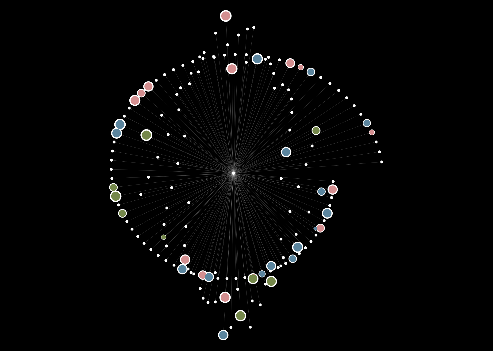

<!-- README.md is generated from README.Rmd. Please edit that file -->

# parametric-systems

<!-- badges: start -->
<!-- badges: end -->

In this repository I keep my experiments with “parametric systems” for
creating algorithmic art.

The initial inspiration for this was the wonderfully minimalistic
[tweetable
art](https://fronkonstin.com/2018/09/06/tweetable-mathematical-art-with-r/)
of Antonio Sanchez Chinchón.

Parametric systems might be a bit of a misnomer for what I am doing
here, but never mind that: there are some examples of line art with
[parametric
equations](https://en.wikipedia.org/wiki/Parametric_equation), some
simulated [harmonographs](https://en.wikipedia.org/wiki/Harmonograph),
and some [turtle
walks](https://runestone.academy/ns/books/published/thinkcspy/MoreAboutIteration/RandomlyWalkingTurtles.html).

As I was doing the turtle walks I realized that they could be turned
into radial patterns, like those of [Ijeamaka
Anyene](https://github.com/Ijeamakaanyene/patterns).

These are some examples of the outputs of these systems.

## Parametric systems

 \##
Harmonographs

## Twin spiral turtle walks

## Radial turtle walks with diagonals

## Radial turtle walks with paths

